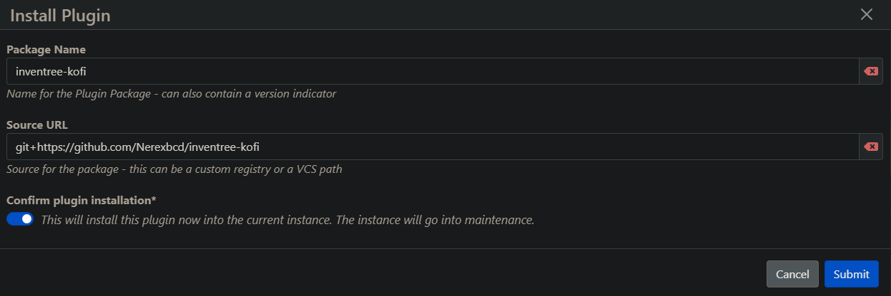
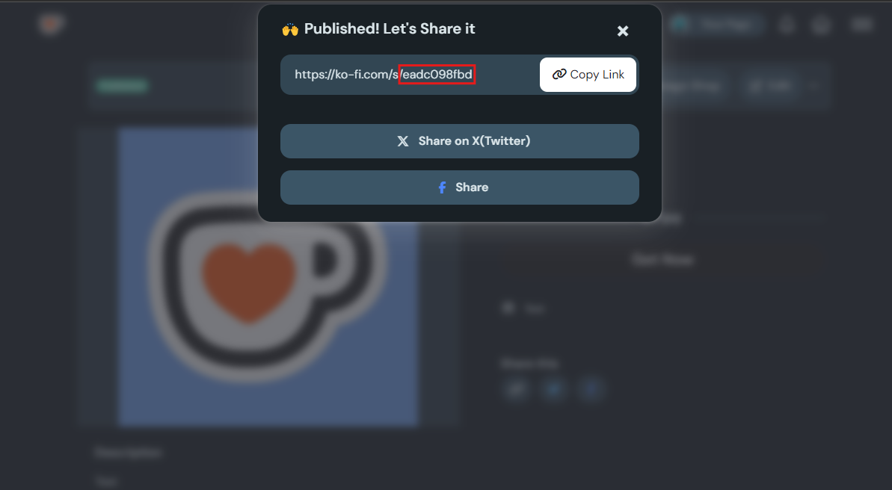
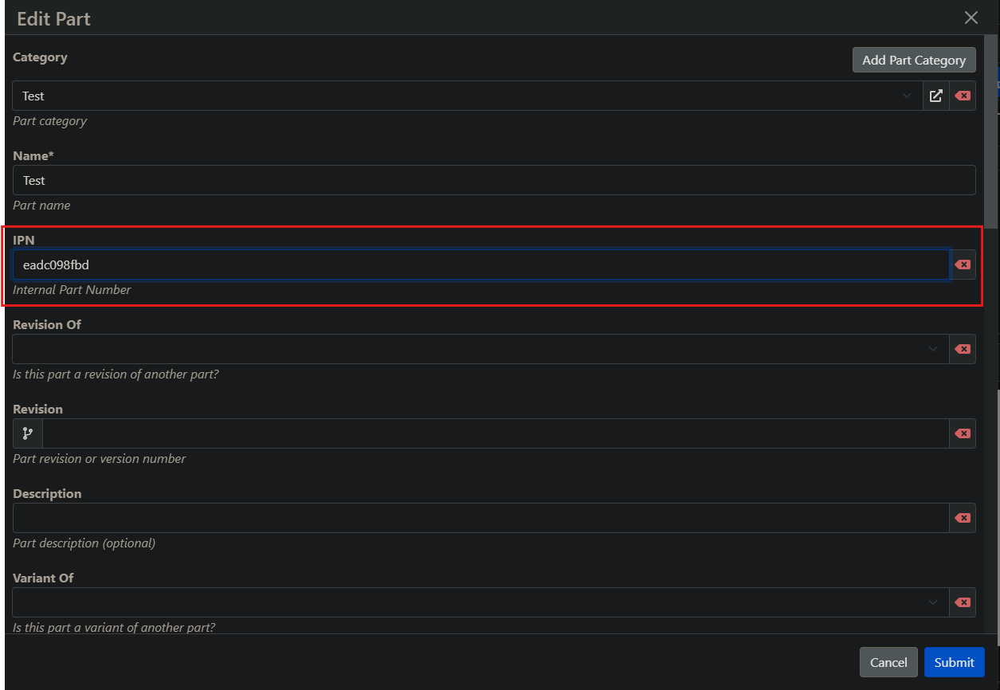

# inventree-kofi
### InvenTree Ko-fi Store Integration

## :question: What is this?
This is an Integration of InvenTree with Ko-fi that when someone orders something on your Ko-fi, it automaticaly creates a new order on a pre-created company (Ko-fi) and add's Your client address and contact to it.

## :toolbox: How to Install
### > Option 1
#### Install on the Virtual environment 
```shell
pip install -U git+https://github.com/Nerexbcd/inventree-kofi
```

### > Option 2
#### Install via UI
<div align="center">
  
</div>
```
git+https://github.com/Nerexbcd/inventree-kofi
```

## :gear: How to configure

> [!IMPORTANT]   
> The part IPN is the associated Ko-fi unique link

> [!IMPORTANT]   
> The Ko-fi Variant is saved on the Part Order Notes

#### Create the Ko-fi item on your Ko-fi Shop and get the Ko-fi Product Link:
<div align="center">
  
</div>    
    
#### Set Your Part IPN to be the Ko-fi item unique link:
<div align="center">
  
</div>

<!-- License -->
## :warning: License

Distributed under the [MIT](https://choosealicense.com/licenses/mit/) License. See [LICENSE.txt](https://github.com/Nerexbcd/inventree-kofi/blob/master/LICENSE) for more information.
